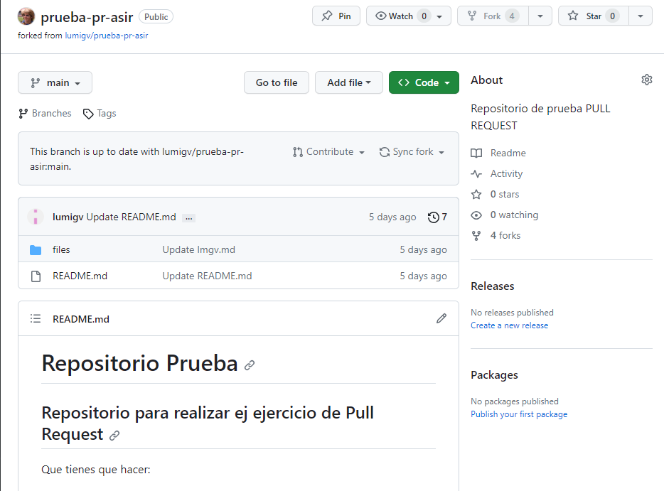
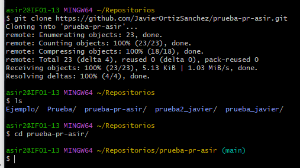
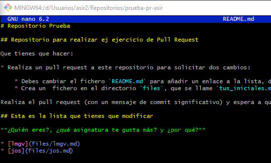
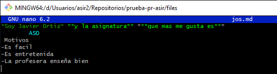
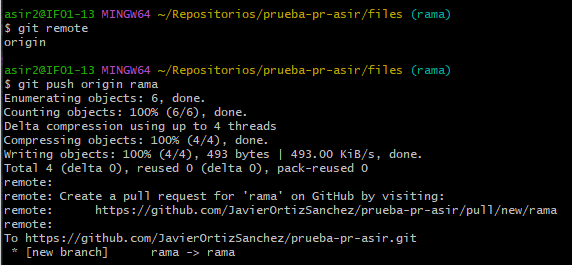

### Primero hacemos un fork del repositorio en elq ue trabajaremos.

### Clonamos el repositorio al git bash.

### Modificams el fichero README escribiendo un enlace al fichero que haremos despues.

### Creamos y escribimos en el fichero antes mencionado.

### Actualizamos el repositorio de github para que las cosas realizadas en git bash esten tambien en el repositorio local.

### El ultimo paso es mandar la solicitud para que el dueño del repositorio te acepte y se produzcan los cambios, todo esto desde la pagina de github.